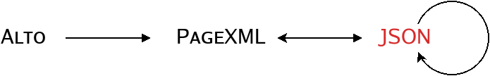

# SegtFormats: a toolbox for minimalistic segmentation metadata.

SegtFormat allows for handling a subset of features found in common page layout formats (PAGE, ALTO) with a focus on HTR tasks:

+ 1 label document = 1 image = 1 page[^†]
+ two types of objects only: regions (as bounding boxes) and lines (baselines and polygons)
+ conversion between common segmentation metadata formats ([Page](http://schema.primaresearch.org/PAGE/gts/pagecontent/2019-07-15), [ALTO](http://www.loc.gov/standards/alto/v4/alto-4-2.xsd)).
+ custom JSON representation documented in our [schema](doc/seg_schema.json): the dictionary allows for easy structural transformations (flattening, region and/or line extraction) or for semantic transformations (line-to-region assignments, boundaries).
+ for metadata only: the image is not needed.
+ validation options (PAGE, JSON)
+ no fancy visuals: however a page segmentation can be conveniently rendered in ASCII on the terminal, for diagnosis purpose.

[^†]: Neither of the commonly used formats enforces the 1-1-1 cardinality: with PAGE, 1 document may label _n_ images (each corresponding to exactly 1 `Page` element); in ALTO, 1 document labels exactly 1 image and possibly _n_ pages within it.



## How to install

<!--

  ```bash
  pip install segtformats
  ```

or from GitHub:
-->

From GitHub:

  ```bash
  git clone git@github.com:nicolasrenet/segtformats.git
  cd segtformats
  pip install .
  ```

From PyPi: 
 
  ```bash
  TBA
  ```


## How to use

### Library functions: examples

```python
from segtformats import segtformats as sgf

# Alto to PageXML stream
page_xml_str = sgf.alto_to_page_xml('tests/data/217_d9c7f_default.alto.xml')

# Alto to PageXML file
sgf.alto_to_page_xml('tests/data/217_d9c7f_default.alto.xml', output_file='217_d9c7f_default.alto.page.xml')

# Alto to JSON dictionary
segmentation_dict = sgf.alto_to_segmentation_dict('tests/data/217_d9c7f_default.alto.xml')
# validation
assert sgf.json_validate( segmentation_dict )

# ASCII rendition
print(sgf.anyseg_to_ascii('tests/data/btv1b84473026_f25.chocomufin.xml', lines=1, scale_hw=.8))
```


### Command-line utilities

+ `alto_to_page_xml`: Alto → Page conversion. Eg.

  ```bash
  alto_to_page_xml tests/data/217_d9c7f_default.alto.xml
  ```

+ `alto_to_json`: Alto → JSON conversion. Eg.

  ```bash
  alto_to_json tests/data/217_d9c7f_default.alto.xml
  ```

+ `page_xml_to_json`: Page → JSON conversion. Eg.

  ```bash
  page_xml_to_json tests/data/217_d9c7f_default.page.xml
  ```

+ `anyseg_to_json`: Detect input format and convert to JSON. Eg.

  ```bash
  anyseg_to_json --file_paths tests/data/*.xml
  ```

+ `json_to_page_xml`: JSON → Page conversion.

  ```bash
  json_to_page_xml tests/data/217_d9c7f_default.json
  ```

+ `anyseg_doctor`: Various transformations on JSON metadata, including repairs (region boundaries, line-to-region assignments).

  ```bash
  # diagnosis-only by default (dry run)
  anyseg_doctor tests/data/217_d9c7f_default.page.xml
  # repairing an ALTO file, with PAGE output
  anyseg_doctor --repair --output_format page --output_suffix .fixed.xml tests/data/217_d9c7f_default.alto.xml 
  ```

+ `anyseg_to_ascii`: Render segmentation metadata on the terminal. Eg.

  ```bash
  anyseg_to_ascii --file_paths tests/data/*.xml
  ```

+ `page_xml_split`: Split multi-page PAGE label into as many files (i.e. one label per image). Eg.

  ```bash
  page_xml_split --file_paths tests/data/2923.xml
  ```

Get the help on any `<command>` with

```bash
python3 -m segtformats.<command> -h
```


## TODO:

+ Page → Alto
